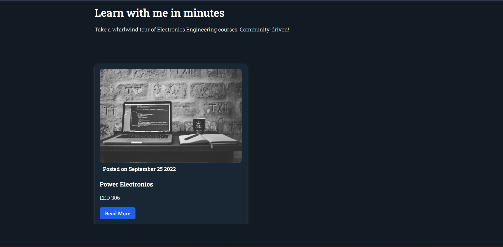
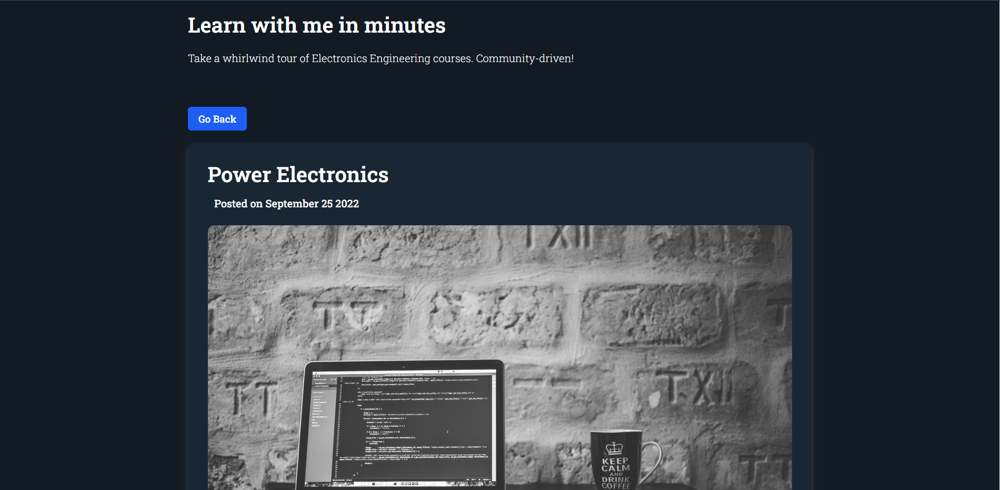

# Learn with me in minutes
 

 

   Take a whirlwind tour of Electronics Engineering courses. Community-driven!

  Access your missed classnotes here from anywhere.
   
  Beautiful handwritten notes, checked by professors, something you can trust on!

 

# Running locally in development mode

To get started, just clone the repository and run `npm install && npm run dev`:

    git clone https://github.com/iaincollins/nextjs-starter.git
    npm install
    npm run dev

Note: If you are running on Windows run install --noptional flag (i.e. `npm install --no-optional`) which will skip installing fsevents.

## Building and deploying in production

If you wanted to run this site in production, you should install modules then build the site with `npm run build` and run it with `npm start`:

    npm install
    npm run build
    npm start

You should run `npm run build` again any time you make changes to the site.

Note: If you are already running a webserver on port 80 (e.g. Macs usually have the Apache webserver running on port 80) you can still start the example in production mode by passing a different port as an Environment Variable when starting (e.g. `PORT=3000 npm start`).

 

# Contributing to learnwithmeinminutes
We love your input! We want to make contributing to this project as easy and transparent as possible, whether it's:

- Reporting a bug
- Discussing the current state of the code
- Submitting a fix/error
- Proposing new features
- Becoming a maintainer

## We Develop with Github
We use github to host code, to track issues and feature requests, as well as accept pull requests.

## We Use [Github Flow](https://github.com/Himanshu-370/learnwithmeinminutes), So All Code Changes Happen Through Pull Requests
Pull requests are the best way to propose changes to the codebase (we use . We actively welcome your pull requests:

1. Fork the repo and create your branch from `main`.
2. If you've added code that should be tested, add tests.
3. If you've added features, update the documentation.
4. Ensure the test suite passes.
5. Make sure your code lints.
6. Issue that pull request!

## Any contributions you make will be under the GNU General Public License
In short, when you submit code changes, your submissions are understood to be under the same [GNU License](https://choosealicense.com/licenses/gpl-3.0/) that covers the project. Feel free to contact the maintainers if that's a concern.

## Report bugs using Github's [issues](https://github.com/Himanshu-370/learnwithmeinminutes/issues)
We use GitHub issues to track public bugs. Report a bug by [opening a new issue](); it's that easy!

## Write bug reports with detail, background, and sample code
[This is an example](http://stackoverflow.com/q/12488905/180626) of a bug report, and I think it's not a bad model. Here's [another example from Craig Hockenberry](http://www.openradar.me/11905408), an app developer whom I greatly respect.

**Great Bug Reports** tend to have:

- A quick summary and/or background
- Steps to reproduce
  - Be specific!
  - Give sample code if you can. [Stackoverflow question](http://stackoverflow.com/q/12488905/180626) includes sample code that *anyone* with a base R setup can run to reproduce what I was seeing
- What you expected would happen
- What actually happens
- Notes (possibly including why you think this might be happening, or stuff you tried that didn't work)

People *love* thorough bug reports. I'm not even kidding.

## Use a Consistent Coding Style
I'm again borrowing these from [Facebook's Guidelines](https://github.com/facebook/draft-js/blob/a9316a723f9e918afde44dea68b5f9f39b7d9b00/CONTRIBUTING.md)

* 2 spaces for indentation rather than tabs
* You can try running `npm run lint` for style unification

## License
By contributing, you agree that your contributions will be licensed under its GNU License.

## References
This document was adapted from the open-source contribution guidelines for [Facebook's Draft](https://github.com/facebook/draft-js/blob/a9316a723f9e918afde44dea68b5f9f39b7d9b00/CONTRIBUTING.md)

# Contributors
Anyone who wants to collab and or raises issues or solve it will be mentioned here.

<<<<<<< HEAD

=======

>>>>>>> 86a71ac46358d15225a79661e5a1dc3e74e44a4a
