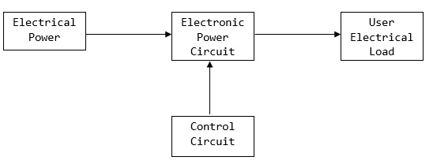

# Power Electronics
## **Introduction**

### **What is Power Electronics?**
Power Electronics refers to the process of controlling the flow of current and voltage and converting it to a form that is suitable for user loads. The most desirable power electronic system is one whose efficiency and reliability is 100%.

### **What are Power Conditioning Circuits?**
A power conditioner is an electrical component designed to improve the quality of power supplied to a computer component by supplying voltage at the level that allows that component to operate properly.

A power conditioner has the ability to regulate and clean AC power by delivering dynamic power adjustments and removing irregularities, which may damage or affect the performance of any equipment load.

Two of the various types of power conditioners are alternating current (AC) power conditioners and power line conditioners.

### **What is Power Electronic Converters?**
Power electronic converters play the role of taking electrical energy from the power system and turning it into a suitable form needed by a motor.

- For DC drives, power electronic converters such as a controlled rectifier or a chopper can be used to adjust the DC power.
- AC drives mostly use an inverter to adjust the voltage and frequency in the AC power.

### **What is Power Electronic Switches?**
A power electronic switching device is a combination of active switchable power semiconductor drivers that have been integrated into one. 
Power switching devices are normally selected based on the rating at which they handle power, that is, the product of their current and voltage rating instead of their power dissipation rate.

### **What is a Diode?**
A diode is a semiconductor switching device which is constructed by combining two layers of N-type and P-type semiconductor materials.

A diode has only one **PN-junction** and two terminals viz. **anode** (positive terminal of the diode) and **cathode** (negative terminal). There are two modes of operation of diode, i.e. **forward bias** and **reverse bias**.

- Forward biasing of diode means the anode is connected to positive terminal of battery and cathode to the negative terminal battery and in the forward biased mode, the diode acts as a closed switch.

- While in the reverse biased mode, the anode is connected to the negative terminal and cathode is connected to the positive terminal of source. In the reverse bias mode, the diode works an open switch.

Therefore, a diode is a unidirectional semiconductor switch which allows current only in forward direction and blocks in the current in the reverse direction. Thus, it is widely used in rectification, i.e., for the conversion of AC into DC.

### **What is Transistor?**
A transistor is also a semiconductor switching device consists of three layers of P-type and N-type semiconductor materials. The transistor has two PN junctions and three terminals named emitter, base and collector.

A transistor is formed by sandwiching either a P-type semiconductor between two N-type semiconductors or an N-type semiconductor between two P-type semiconductors. Thus, based on the construction, the transistors are of following two types −
- NPN Transistor
- PNP Transistor

A transistor is widely used in the different electronic circuits as amplifier and digital switch etc.

#### **Difference between Diode and Transistor:**

| Point of Difference   |      Diode      |  Transistor |
|-----------------------|:---------------:|------------:|
| Definition |  A diode is two terminal semiconductor switching device which allows current flow only in one direction. | A transistor is three terminal semiconductor device which is capable of switching and amplifying the signals. |
| Construction |    A diode is constructed by joining a P-type semiconductor material with an N-type semiconductor material.   |   A transistor is constructed by sandwiching either a P-type semiconductor between two N-type semiconductors or an N-type semiconductor between two P-type semiconductors. |
| Number of PN junctions | Diode has one PN junction. |    Transistor has two PN junctions. |
| Terminals |	Diode has two terminals named anode and cathode. |	Transistor has three terminals, i.e. emitter, base and collector.
| Types | There are various types of diodes such as signal diode, power diode, Zener diode, LED, etc. | Transistor are mainly of two types: BJT (Bipolar Junction Transistors) and FET (Field Effect Transistors). 
| Depletion region	| There is only one depletion region in a diode at the PN junction. | There are two depletion regions in a transistor. |
| Modes of operation | Diode can operate only as a switch. Where closed switch in forward bias and open switch in reverse bias.	|   Transistor can be operated as switch as well as amplifier. In active region, it operates as an amplifier. While in saturation region as closed switch and in cut-off region as open switch.
| Applications | Diode finds application in electronic circuits such as clipping, clamping, rectifiers, voltage multipliers, etc. | Transistors are used as electronic switches, amplifiers, oscillators, regulators, etc.

### **Difference between Power Diode and Signal Diode:**
1. Power diode is constructed with n-layer, called drift region between the p+ layer and n+ layer. In Signal diode, the drift region is not present.

2. The voltage, current, and power ratings are higher in the power diode while it is lower in the signal.

3. Power diodes operate at high speeds. Signal diode operates at higher switching speed.